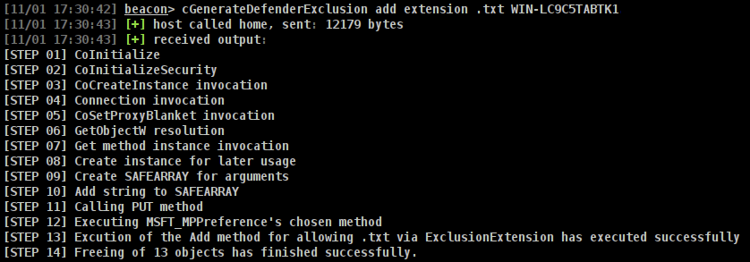

## Defender Exclusions Creator BOF

---
#### What
A `BOF` to add or remove `Windows Defender` exclusions:
  - Extensions
  - Processes
  - Folders
---

#### Why
Examples of using the `C++` compiler to create `BOF`s without the need for the intermediary `vtable` dereferences.

As well, to prove it was indeed possible to do so without accessing the managed variant exposed via `Powershell` cmdlets; e.g. `Set-MpPreference`.

---
#### Supported Methods
- `Add`
- `Remove`
---

#### Supported Exception Types
- `Path`
- `Process`
- `Extension`

---

#### Building
```sh
cd src
make all
```
---

#### Usage
1) Load `dist/cGenerateDefenderExclusion.cna`
2) Run in a `Beacon`:
    - `cEnumDefenderException (add|remove) (extension|path|process) thing_to_add_or_remove_exception_for [optional computer name]`
---

#### Outputs
